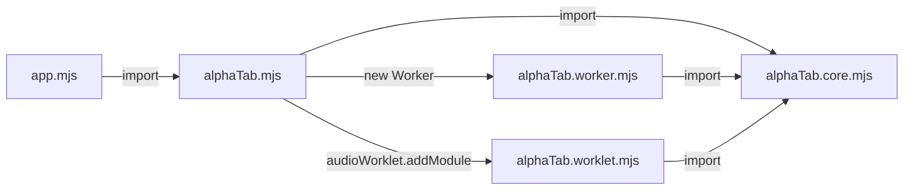

import Tabs from '@theme/Tabs';
import TabItem from '@theme/TabItem';
import { SinceBadge } from '@site/src/components/SinceBadge';

<SinceBadge since="1.3.0" />

:::info
**TL;DR:** AlphaTab comes with a Vite plugin which should be added to your Vite config to guarantee compatibility. 
```js
import { defineConfig } from "vite";
import { alphaTab } from "@coderline/alphatab-vite";

export default defineConfig({
  plugins: [alphaTab()]
});
```
:::

alphaTab internally off-loads some work to background workers to not block the browser while rendering or generating audio. 
These background workers are realized through [Web Workers](https://developer.mozilla.org/en-US/docs/Web/API/Web_Workers_API) and [Audio Worklets](https://developer.mozilla.org/en-US/docs/Web/API/Web_Audio_API/Using_AudioWorklet).

Without bundlers like Vite, alphaTab simply launches these workers by starting the `./alphaTab.worker.[m]js` or `./alphaTab.worklet.[m]js`. The dependency diagram without bundlers using JavaScript modules looks like this: 



Vite might splitup and merge files which makes it impossible for alphaTab to locate the right entry points for the Workers.

Due to this reason alphaTab ships a custom Vite plugin which takes care of configuring Vite automatically and ensuring that all features work as intended:

* It ensures the Web Font (Bravura) and the SoundFont (SONiVOX) shipped with alphaTab are copied to the build output and made available through `<root>/font/` and `<root>/soundfont/` of your application.
* It ensures Web Workers and Audio Worklets are correctly configured and working. 

If you are using a framework like Angular, React or Vue.js you might read in their documentation on how the Vite settings can be customized. Typically you will find a `vite.config.<ext>` in your project. 
You might check out a fresh project created via https://vitejs.dev/guide/#scaffolding-your-first-vite-project 

Unless there is something special to your project setup, adding the plugin to the list is everything you need to do:

```js
// CommonJS
const alphaTab = require('@coderline/alphatab-vite');
// JavaScript modules
import { alphaTab } from '@coderline/alphatab-vite';

// Add the plugin to your config
export default defineConfig({
  plugins: [alphaTab()]
});
```


## Configure Plugin

The plugin behavior can be configured and customized depending on needs. 

<Tabs defaultValue="source-dir" values={[
    { label: "alphaTab source directory", value: "source-dir"},
    { label: "Asset copy", value: "assets"},
    { label: "Audio Worklets", value: "worklets"},
    { label: "Web Workers", value: "workers"},
]}>

<TabItem value="source-dir">

By default the alphaTab files are searched within `node_modules/@coderline/alphaTab/dist`. If you're using a special alphaTab build 
or your project structure is special, you can tell the plugin through a setting where to find the files: 

```js
export default defineConfig({
  plugins: [alphaTab({
    alphaTabSourceDir: path.resolve('../../node_modules/@coderline/alphaTab/dist')
  })]
});
```

</TabItem>

<TabItem value="assets">

alphaTab comes with a bundled Bravura and SONiVOX. alphaTab will load them during runtime and therefore these assets
are copied to the build output. The asset copy functionality of the plugin will copy the files the build output directory 
under `/font` and `/soundfont` respectively and also will ensure that these files are served by the WebPack Dev Server as
assets. 

If you prefer to take care of the asset bundling and paths yourself, or you want to change the output path there are options for that:

```js
// disable asset copying 
export default defineConfig({
  plugins: [alphaTab({
    assetOutputDir: false
  })]
});

// change path 
export default defineConfig({
  plugins: [alphaTab({
    assetOutputDir: path.resolve('../dist/vendor/assets/')
  })]
});
```

</TabItem>

<TabItem value="worklets">

Vite comes with built-in support for Web Workers but not for Audio Worklets. 
To bridge that gap until maybe the feature will be supported officially in Vite, alphaTab ships this functionality itself.

If there are problems with this feature or an alternative plugin is used for audio worklet support, this feature can be disabled:

```js
export default defineConfig({
  plugins: [alphaTab({
    audioWorklets: false
  })]
});
```

:::warning 
If this audio worklet support is disabled this might break the audio playback through worklets. You might configure
[`player.outputMode`](/docs/reference/settings/player/outputmode) to use always the ScriptProcessorNode.
:::

</TabItem>

<TabItem value="workers">

Vite comes with built-in support for Web Workers but it has quite some limitations. There is only one shared WebWorker configuration
for the whole project it might be in conflict with other plugins what alphaTab needs. 
Hence alphaTab comes with a custom handler which ensures the WebWorker functionality works. 

If there are problems with this feature or an alternative plugin is used for worker support, this feature can be disabled:

```js
export default defineConfig({
  plugins: [alphaTab({
    webWorkers: false
  })]
});
```

:::warning 
If this web worker support is disabled this might break the rendering audio playback through workers. You might configure  
[`core.useWorkers`](/docs/reference/settings/core/useworkers) to use always the main thread. 
The UI responsiveness and generally experienced performance might be degraded heavily by this. 
:::

</TabItem>

</Tabs>

## Samples

You can check out the sample projects at https://github.com/CoderLine/alphaTabSamplesWeb/tree/main/src to find a reference you can look at. 
They offer some very minimal setup of alphaTab for different project constellations.

:::warning
Angular does not provide built-in ways of customizing bundler configurations. In the latest Versions they use Vite for the development server and ESBuild for building.
But they offer no customizations to this. 

The popular alternative builders https://github.com/just-jeb/angular-builders also do not have support for Vite yet. This means if you want to use AlphaTab with your Angular application you have 
to use [WebPack](installation-webpack) as bundler.

:::
