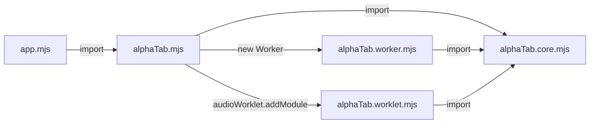

import Tabs from '@theme/Tabs';
import TabItem from '@theme/TabItem';
import { SinceBadge } from '@site/src/components/SinceBadge';

<SinceBadge since="1.3.0" />

:::info
**TL;DR:**  AlphaTab comes with a WebPack 5 plugin which should be added to your WebPack config to guarantee compatibility. 
```js
import { AlphaTabWebPackPlugin } from '@coderline/alphatab-webpack';

const webpackConfig =  {
    plugins: [
        new AlphaTabWebPackPlugin()
    ]
}
```
:::

alphaTab internally off-loads some work to background workers to not block the browser while rendering or generating audio. 
These background workers are realized through [Web Workers](https://developer.mozilla.org/en-US/docs/Web/API/Web_Workers_API) and [Audio Worklets](https://developer.mozilla.org/en-US/docs/Web/API/Web_Audio_API/Using_AudioWorklet).

Without bundlers like WebPack, alphaTab simply launches these workers by starting the `./alphaTab.worker.[m]js` or `./alphaTab.worklet.[m]js`. The dependency diagram without bundlers using JavaScript modules looks like this: 



WebPack might splitup and merge files which makes it impossible for alphaTab to locate the right entry points for the Workers.

Due to this reason alphaTab ships a custom WebPack plugin which takes care of configuring WebPack automatically and ensuring that all features work as intended:

* It ensures the Web Font (Bravura) and the SoundFont (SONiVOX) shipped with alphaTab are copied to the build output and made available through `<root>/font/` and `<root>/soundfont/` of your application.
* It ensures Web Workers and Audio Worklets are correctly configured and working. 

If you are using a framework like Angular, React or Vue.js you might read in their documentation on how the WebPack settings can be customized. 

:::info
We are also using this plugin on [alphaTab.net](https://alphatab.net) ourselves. 
:::

Unless there is something special to your project setup, adding the plugin to the list is everything you need to do:

```js
// CommonJS
const AlphaTabWebPackPlugin = require('@coderline/alphatab-webpack');
// JavaScript modules
import { AlphaTabWebPackPlugin } from '@coderline/alphatab-webpack';

// Add the plugin to your config
const config = {
    plugins: [
        new AlphaTabWebPackPlugin()
    ]
};
```

## Configure Plugin

The plugin behavior can be configured and customized depending on needs. 

<Tabs defaultValue="source-dir" values={[
    { label: "alphaTab source directory", value: "source-dir"},
    { label: "Asset copy", value: "assets"},
    { label: "Audio Worklets", value: "worklets"},
    { label: "Web Workers", value: "workers"},
]}>

<TabItem value="source-dir">

By default the alphaTab files are searched within `node_modules/@coderline/alphaTab/dist`. If you're using a special alphaTab build 
or your project structure is special, you can tell the plugin through a setting where to find the files: 

```js
new AlphaTabWebPackPlugin({
    alphaTabSourceDir: path.resolve('../../node_modules/@coderline/alphaTab/dist')
})
```

</TabItem>

<TabItem value="assets">

alphaTab comes with a bundled Bravura and SONiVOX. alphaTab will load them during runtime and therefore these assets
are copied to the build output. The asset copy functionality of the plugin will copy the files the build output directory 
under `/font` and `/soundfont` respectively and also will ensure that these files are served by the WebPack Dev Server as
assets. 

If you prefer to take care of the asset bundling and paths yourself, or you want to change the output path there are options for that:

```js
// disable asset copying 
new AlphaTabWebPackPlugin({
    assetOutputDir: false
})
// change path 
new AlphaTabWebPackPlugin({
    assetOutputDir: path.resolve('../dist/vendor/assets/')
})
```

</TabItem>

<TabItem value="worklets">

WebPack comes with built-in support for Web Workers but [not for Audio Worklets](https://github.com/webpack/webpack/issues/11543). 
To bridge that gap until maybe the feature will be supported officially in WebPack, alphaTab ships this functionality itself.

If there are problems with this feature or an alternative plugin is used for audio worklet support, this feature can be disabled:

```js
new AlphaTabWebPackPlugin({
    audioWorklets: false
})
```

:::warning 
If this audio worklet support is disabled this might break the audio playback through worklets. You might configure
[`player.outputMode`](/docs/reference/settings/player/outputmode) to use always the ScriptProcessorNode.
:::

</TabItem>

<TabItem value="workers">

WebPack comes with built-in support for Web Workers in some frameworks like Angular it might be disabled and its cumbersome to reenable it. 
Hence alphaTab comes with a custom handler which ensures the WebWorker functionality works. 

If there are problems with this feature or an alternative plugin is used for worker support, this feature can be disabled:

```js
new AlphaTabWebPackPlugin({
    webWorkers: false
})
```

:::warning 
If this web worker support is disabled this might break the rendering audio playback through workers. You might configure  
[`core.useWorkers`](/docs/reference/settings/core/useworkers) to use always the main thread. 
The UI responsiveness and generally experienced performance might be degraded heavily by this. 
:::

</TabItem>

</Tabs>

## Angular

Unfortunately Angular does not provide an out-of-the-box way to customize the used WebPack config and therefore it can be a bit tricky to get 
the alphaTab plugin into place. The [`@angular-builders/custom-webpack`](https://www.npmjs.com/package/@angular-builders/custom-webpack) enables adding custom webpack configs.

In our [Angular sample](https://github.com/CoderLine/alphaTabSamplesWeb/tree/main/src/webpack-angular) was created like this: 

1. Create a new angular app via 
    * `ng new alphatab-app`
2. Install the package to enable custom webpack configs: 
    * `npm i -D @angular-builders/custom-webpack`
3. Modify the angular.json to enable the custom webpack config: 
```diff
{
  "projects": {
    "alphatab-app": {
      "projectType": "application",
      "schematics": {},
      "root": "",
      "sourceRoot": "src",
      "prefix": "app",
      "architect": {
        "build": {
-          "builder": "@angular-devkit/build-angular:application",
+          "builder": "@angular-builders/custom-webpack:browser",
+          "options": {
+            "customWebPackConfig": {
+              "path": "./custom-webpack.config.js"
+            }
...
        "serve": {
-          "builder": "@angular-devkit/build-angular:dev-server",
+          "builder": "@angular-builders/custom-webpack:dev-server",
+          "options": {
+            "buildTarget": "alphatab-app:build"
+          },
```
4. Add a `custom-webpack.config.js` and add the alphaTab Plugin
```js
const { AlphaTabWebPackPlugin } = require('@coderline/alphatab-webpack');

module.exports = {
    plugins: [
        new AlphaTabWebPackPlugin()
    ]
};
```


